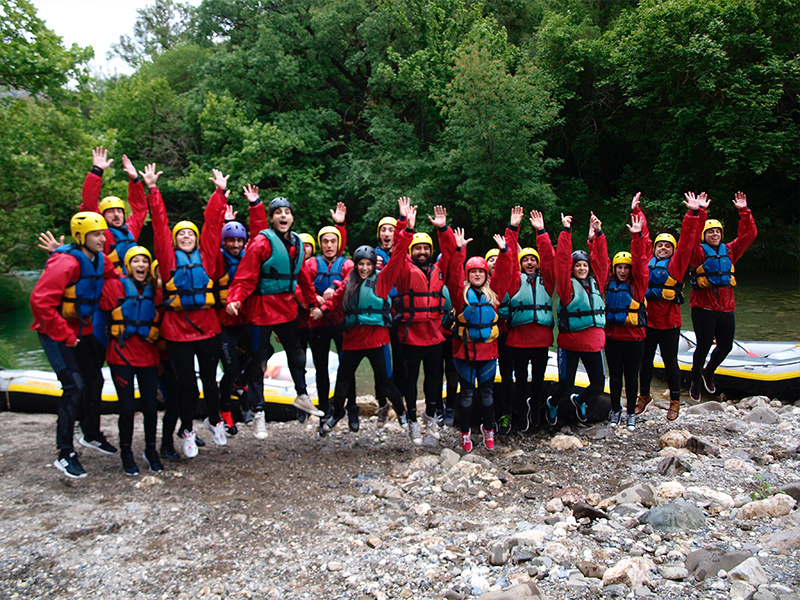
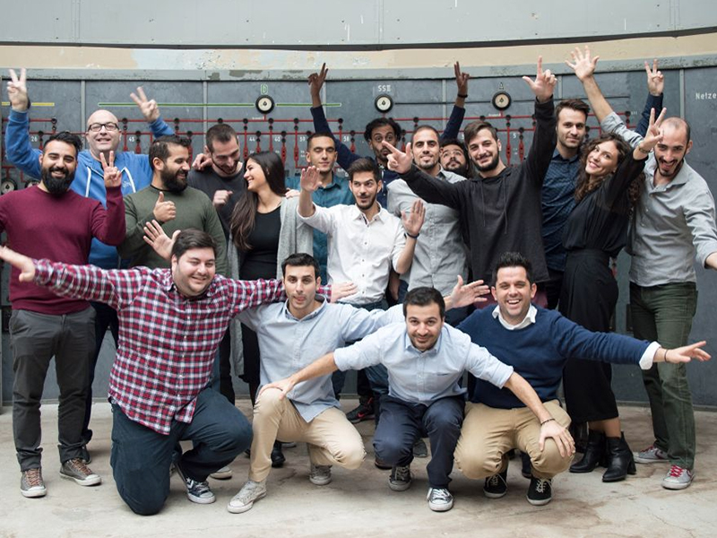
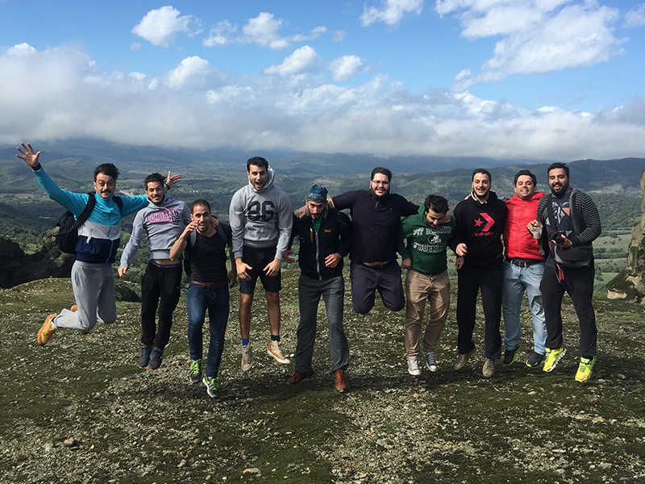



# About {{site.companyName}} 

{{site.companyName}} is a mobile ad tech company fully dedicated to empowering our partners with sophisticated solutions. We make it simple for agencies and brands to connect with target audiences and for publishers to monetize their apps. 

We are growing at a fast pace and looking for exceptional software engineers, UI/UX designers and product managers to help us keep up with the requirements of a product that needs to handle billions of requests each month.

- We are serving more than 200+ billion ad requests / month
- Our team is distributed in 7 offices (Athens, Berlin, Tel Aviv, Nicosia, Beijing, Sao Paolo, San Francisco)

Please read our Candidate FAQ [here](faq.md).

# Open positions

    

        

            

                

                    

                        <i class="icon design_code"></i>
                        
Front-end Software Engineer

                        <a href="/hiring/front-end" class="button-link"> Read More</a>
                    

                

                

                    

                        <i class="icon design_code"></i>
                        
Back-end Software Engineer

                        <a href="/hiring/back-end"  class="button-link"> Read More</a>
                    

                

                

                    

                        <i class="icon design_code"></i>
                        
Full-stack Software Engineer

                        <a href="/hiring/full-stack"  class="button-link"> Read More</a>
                    

                

                

                    

                        <i class="icon design_code"></i>
                        
Junior Data Analyst

                        <a href="/hiring/junior-data-analyst"  class="button-link"> Read More</a>
                    

                

                

                    

                        <i class="icon design_code"></i>
                        
Senior Data Analyst

                        <a href="/hiring/data-analyst"  class="button-link"> Read More</a>
                    

                

            

        

    

# Benefits 

- **Work Stability**
 
Glispa is a fast-growing and profitable company. This guarantees that not only you will get generously compensated, but you will also enjoy full financial security and stability.

- **Control Your Own Time**
 
We believe in quality over quantity, so our working hours are flexible. You can choose those that make you feel comfortable, while making sure you have a decent overlap with the rest of the team. There is also the chance of occasional remote work if one day you feel like staying at home.

- **Training Budget**
 
If you need more time to learn about our stack, product, study a new language or framework you can freely do so during working hours. Also any expenses for material that you may need such as books or online courses are covered by {{site.companyName}}. 

- **Free Equipment of Your Choice**
 
Everyone's needs and workflow are different and we understand that. You will have the opportunity to choose the equipment that makes you more comfortable working with.

- **Private Health Insurance**
 
We provide one of the best private insurance plans in Greece, with full medical coverage in almost all the major private medical centers in Greece.

- **Free Fruits & Snacks**
 
The office is always stocked with free fruits and snacks. Also, several times each month we organize free lunches for everyone at the office.

# Team Culture

- **Work-life Balance**
 
We value our work-life balance and therefore we avoid strict deadlines and working long hours. We deliver great software in time but never at the expense of our physical and mental health.

- **Trasparency**
 
We aim for full transparency because we believe information is power. Metrics such as revenue, costs and profit are available for everyone in the team to review at any time starting from your first day at {{site.companyName}}. 

- **Flat Structure**
 
We avoid unnecessary hierarchies and bureaucracy by keeping our team’s structure flat. Everyone has equal say in the future of the product and no one will ever dictate to you how you’ll write your code or what technologies you’ll choose. 

- **Small Cross-functional Teams**
 
We work in small teams that are comprised of people from different skills sets. This means that each team is independent, can move at a different pace and choose different tools and methodologies.

- **Exprimenting With New Technologies & Positions**
 
We like to experiment with new technologies and frameworks. Our stack is comprised of various technologies and languages. Also, team members can move between projects, teams and even functions if they wish. For example, it’s not unusual for a person to decide to move from backend to full-stack (or vice versa).

# Having fun

    

      

          

            
            

              
Trip to Karitaina

              <a href="https://photos.app.goo.gl/gyLKGhWgQoQb1z5E3" class="button-link">See Photos</a>
            

          

          

            
            

              
Trips to Berlin

              <a href="https://photos.app.goo.gl/qomZvasQCNYQAXnq2" class="button-link">See Photos</a>
            

          

          

            
            

              
Trip to Meteora

              <a href="https://photos.app.goo.gl/DPVwWsJFBBOPJPCU2" class="button-link">See Photos</a>
            

          

      

    


